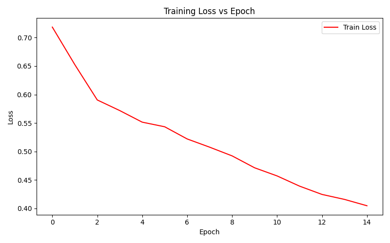
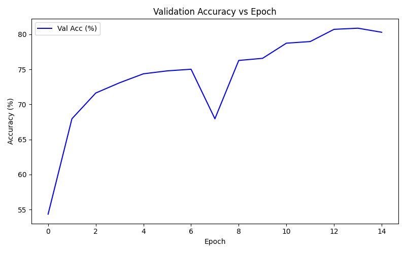

# Alzheimer's Classification Task 8

This folder contains the code for Task 8: Classifying Alzheimers. 

Student Name: Wing Yan Lee

Student ID: s4749017


## Problem Description
Brain MRI slices/segments are analysed to classify Alzheimer's Disease (AD) or Normal Control (NC). AD is a progressive neurodegenerative condition that structurally changes the brain and causes a loss of brain tissues [3]. The brain will show changes such as cortical thinning and ventricular enlargement which can show up on MRI scans [3].

## Model Architecture
Based on ConvNeXt, a modern convolutional architecture designed to be competitive with Vision Transformers while keeping a pure ConvNet design [1]. ConvNeXt keeps ResNet-style skip connections, but uses updated design choices (large kernels, LayerNorm, depthwise convs, etc.) to scale better [1].

#### ConvNeXt
ConvNeXt Small was used:
```python
class ConvNeXt(nn.Module):
    def __init__(
        self,
        num_classes: int = 2,
        in_chans: int = 1,
        depths = (3, 3, 9, 3),
        dims   = (96, 192, 384, 768),
        drop_path_rate: float = 0.0,
        layer_scale_init_value: float = 1e-6,
        pretrained: bool = False,
    ):
```
Code was adapted from the official ConvNeXt reference [2].

## Files

### Dataset
Dataset.py contains code that handles data loading, preprocessing and splitting.

### Modules
Modules.py contains code that define the model in this case, ConvNeXt. This code is obtained from https://github.com/facebookresearch/ConvNeXt/blob/main/models/convnext.py#L87.

### Train
Train.py contains code for the main training script. 
#### Training Set Up

```
EPOCHS          = 15
LEARNING_RATE   = 3e-4
WEIGHT_DECAY    = 1e-2
MAX_GRAD_NORM   = 1.0
EARLY_PATIENCE  = 10
MODEL_PATH      = "./models/best_convnext.pth"
FIG_DIR         = "./figures"
DEVICE          = "cuda" if torch.cuda.is_available() else ("mps" if hasattr(torch.backends, "mps") and torch.backends.mps.is_available() else "cpu")
NUM_CLASSES     = 2
IN_CHANS        = 1
```
These values define the learning rate, epochs, gradient clippings and the model saving path. There is early stopping at 10 epochs if no validation loss does not improve (useful for refining training purposes). 


## How it Works

1. **Preparing the Dataset**
- Two folders (AD - Alzheimers and NC - Normal Control) are loaded in from Rangpur provided data. 
- Data is split, ensuring no overlap, into train, validation and test sets. 

2. **Model**
- ConvNeXt for 2-class classification. 

3. **Training**
- Cross Entropy loss 
- AdamW optimiser
- Plot across epochs to view accuracy and loss
- Optimal learning rate scheduler

## Dependencies
Ensure appropriate libraries are installed. 
1. torch
2. torchvision
3. numpy
4. scikit-learn
5. matplotlib
6. Pillow
7. tqdm

## How to Run
### Local
python train.py

### UQ Rangpur
sbatch run_task8.slurm
Ensure run_task8.slumr script is in the folder:
#!/bin/bash
#SBATCH --job-name=alzheimers
#SBATCH --gres=gpu:1
#SBATCH --mem=16G
#SBATCH --time=02:00:00
#SBATCH --output=alzheimers_%j.out

module load pytorch/2.3.1
python train.py

## Results
| **Metric**            | **Value** |
|------------------------|-----------|
| Training Accuracy      | ~83%      |
| Validation Accuracy    | ~81%      |
| Test Accuracy          | **82%**   |
| Loss Curve             | See plot below |



**Figure 1. Training Loss Graph**

The training loss consistently decreased from ~0.72 to ~0.40 over 15 epochs, indicating that the model is learning at a steady pace. It also suggests that there are no severe instabilities or overfitting. The optimiser and learning rates may also be well tuned due to the smooth downward trend. 



**Figure 2. Training Accuracy Graph**

The first few epochs show rapid improvement from 54% tot 75%. It gradually stabilises after 10 epochs. There are minor fluctuations at epoch 7 which could suggest sample differences or batch variations. However, there is a strong upward recovery in later epochs that confirm generalisation. 

### Overall
The model shows a clear convergence with steadily decreasing loss and validation accuracy near 80%. There is limited overfitting suggested from the gap between traininig and validation metrics. 

### Next Steps
Fine tuning the pre-training ConvNeXt weights instead of random initialisation to imrpove convergence speed, reduce overfitting and boost accuracy. 


## References
[1]Z. Liu, H. Mao, C.-Y. Wu, C. Feichtenhofer, T. Darrell, and S. Xie, “A ConvNet for the 2020s,” arXiv:2201.03545 [cs], Jan. 2022, Available: https://arxiv.org/abs/2201.03545

[2]facebookresearch, “ConvNeXt/models at main · facebookresearch/ConvNeXt,” GitHub, 2025. https://github.com/facebookresearch/ConvNeXt/tree/main/models (accessed Nov. 02, 2025).

[3]Mayo Clinic, “Alzheimer’s disease,” Mayo Clinic, Nov. 08, 2024. https://www.mayoclinic.org/diseases-conditions/alzheimers-disease/symptoms-causes/syc-20350447
